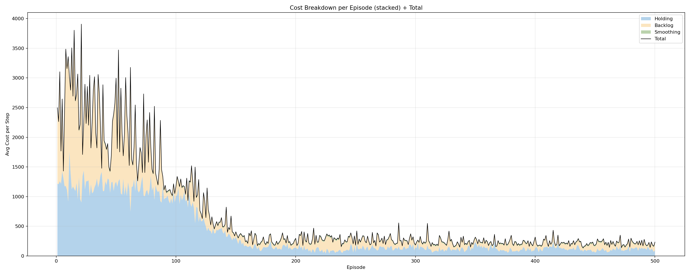
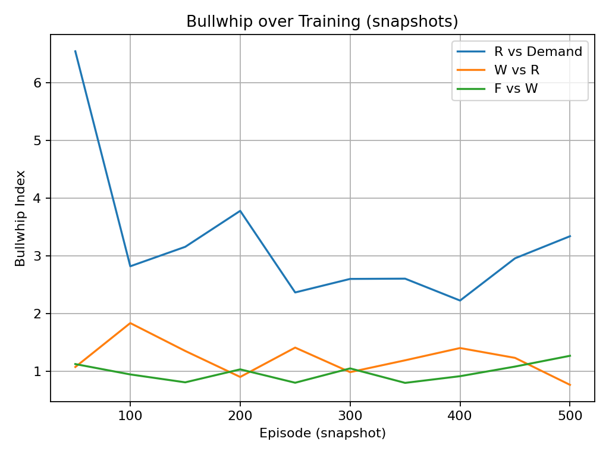
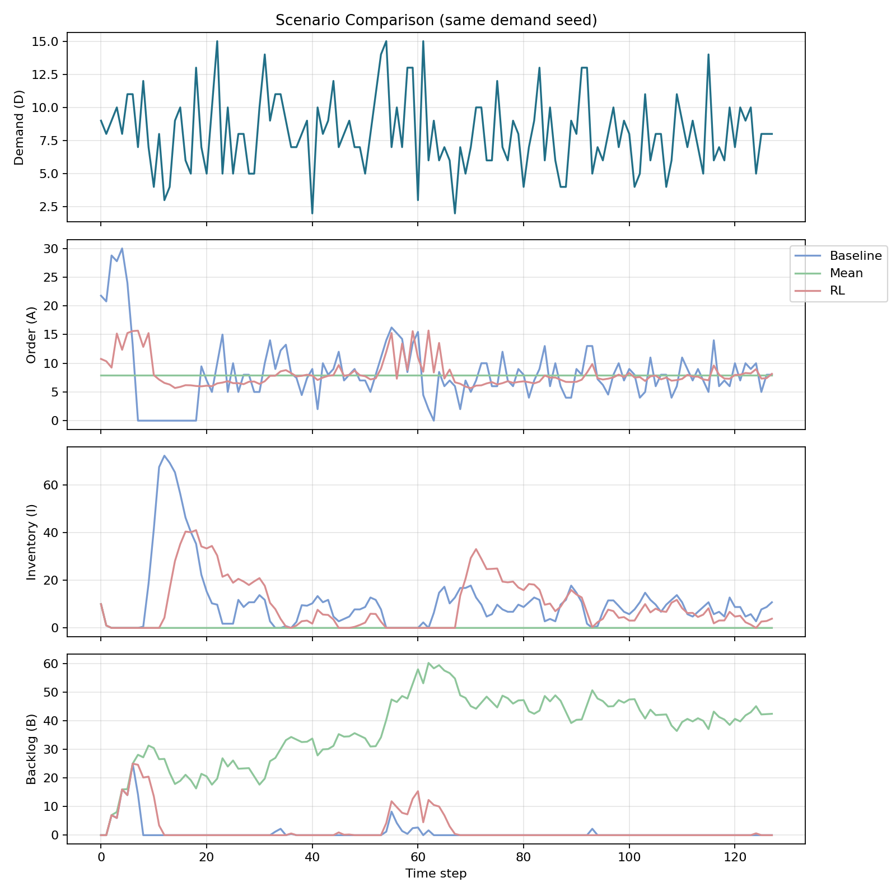
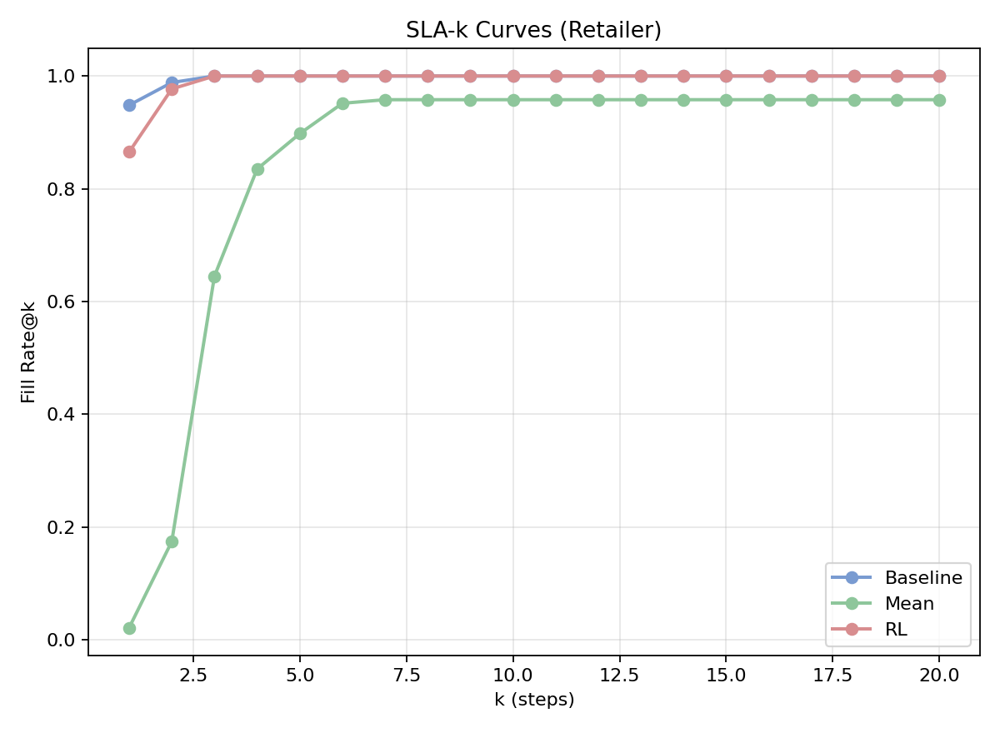
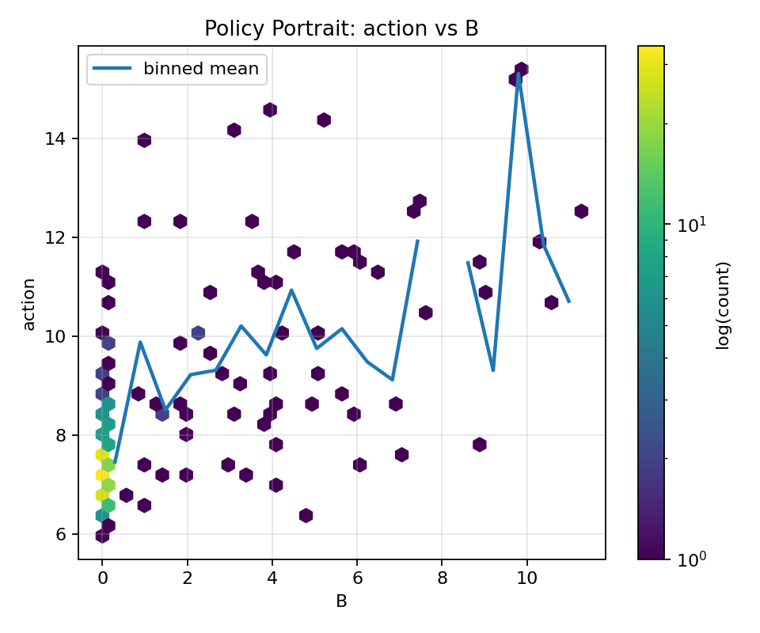

# Multi-Agent Beer Game: Reinforcement Learning and the Bullwhip Effect

<p align="center">
  <a href="README_zh.md">中文版本 🇨🇳</a> | <a href="README.md">English Version 🌍</a>
</p>

---

## 1. Project Overview

In supply chain management, demand fluctuations are often amplified by information delays and asymmetry, resulting in the well-known bullwhip effect. The classical "Beer Game" experiment illustrates this: retailers, wholesalers, distributors, and factories make decisions under local information constraints, which frequently leads to alternating overstock and shortage.

Based on this scenario, we developed a scalable multi-agent environment and adopted **MAPPO (Multi-Agent Proximal Policy Optimization)** to study collaborative decision-making under partial observability. In addition to reproducing traditional base-stock policies and constant mean-ordering strategies, we introduced SLA-k service level metrics and designed multi-dimensional visualizations for systematic evaluation.

Our experiments show that reinforcement learning agents can reduce average costs while effectively suppressing the amplification of order fluctuations. In terms of service levels, MAPPO strategies achieve demand satisfaction within short delivery delays, outperforming baseline methods in both stability and balance. Visualizations including learning curves, radar charts, bar panels, and policy portraits provide intuitive insights into how different strategies control costs, manage risks, and mitigate the bullwhip effect.

This project combines **reproducible experiments, explainable visualization, and RL-based policy comparison** into an integrated framework for supply chain analysis.

---

## 2. Background and Motivation

The Beer Game consists of four roles: retailer → wholesaler → distributor → factory. Final demand is only observed at the retailer end, while upstream orders propagate with delays and distortions. This results in the **bullwhip effect**, where order variance at higher levels far exceeds demand variance.

The bullwhip index is measured as:

\[
BW_i = \frac{\mathrm{Var}(Q_i)}{\mathrm{Var}(D)}
\]

where \(Q_i\) is the order sequence of stage \(i\) and \(D\) is the customer demand sequence. A value \(BW_i > 1\) indicates amplification.

Beyond cost, firms also care about **service levels**. We therefore introduce the **SLA-k metric**, defined as the proportion of demand satisfied within a delivery delay of \(k\) periods.

---

## 3. Environment and Cost Modeling

We implemented `BeerGame3Env`, which supports configurable layers, transport delays, and stochastic demand. Each agent observes local states (inventory, pipeline, backlog), selects a non-negative order action, and faces delayed deliveries.

The stage cost is defined as:

\[
c_t = h I_t^+ + p B_t^+ + \lambda (a_t - a_{t-1})^2 ,
\]

where the three terms represent holding cost, backlog penalty, and smoothing penalty for large order adjustments. Costs are scaled into negative rewards for RL training.

---

## 4. Evaluation Metrics

We evaluate strategies using several dimensions:

- **Average Return**: the negative of average cost per step, used as the RL optimization objective.  
- **Fill Rate**: fraction of demand immediately satisfied.  
- **SLA-k**: proportion of demand fulfilled within k steps.  
- **Bullwhip Index**: order variance amplification along the chain.  
- **Inventory and Backlog Levels**: auxiliary indicators of risk and robustness.  

---

## 5. Policies and Baselines

Our MAPPO agents operate with partial observability, each agent controlling one stage, while sharing a centralized value function for stability. PPO-Clip with KL constraints ensures convergence. Neural networks use MLPs with configurable activation and dropout.

Two baselines are considered:  
(1) Base-stock policy (s,S), where order-up-to levels are derived from service level targets;  
(2) Constant mean-ordering, where agents always order the estimated mean demand.

---

## 6. Visual Analytics

The following figures illustrate our main findings.

### Cost Breakdown
<p align="center">
  
</p>

The stacked cost decomposition reveals that high costs in early training are driven mainly by backlog and holding penalties. As training progresses, both components decline, and the total cost stabilizes at a much lower level.

---

### Bullwhip Effect
<p align="center">
  
</p>

The bullwhip index across chain levels decreases markedly during training. MAPPO agents suppress excessive order variance amplification, leading to smoother upstream operations.

---

### Baseline Comparisons
<p align="center">
  
</p>

Radar charts show MAPPO balancing multiple metrics simultaneously.  
<p align="center">
  
</p>

Bar charts confirm MAPPO's superiority in cost, backlog, and bullwhip control, while maintaining high fill rates.

---

### Scenario Comparison
<p align="center">
  
</p>

Under the same demand trajectory, MAPPO produces smoother orders and more stable inventory compared to the volatile (s,S) policy and the rigid mean-order baseline.

---

### SLA-k Service Levels
<p align="center">
  
</p>

MAPPO achieves near-perfect service levels at very small k, demonstrating its ability to satisfy customer demand promptly, while the mean-order baseline requires much longer delays.

---

### Policy Portrait
<p align="center">
  
</p>

The policy portrait reveals how MAPPO agents adjust order quantities in response to backlog states. Orders increase systematically with backlog, illustrating interpretable and adaptive behavior.

---

## 7. Reproducibility

The environment requires Python 3.10+. Dependencies can be installed via `uv`, `pip`, or `conda`.

Training is launched with:
```bash
python train.py --config configs/default.yaml
```

Results including logs, plots, and weights are stored in `runs/beer3_mappo_*`.

---

## 8. Key Findings

Reinforcement learning agents trained with MAPPO reduce costs, suppress bullwhip amplification, and improve service timeliness compared to traditional baselines. Policy portraits highlight that learned behaviors are interpretable, with adaptive adjustments based on backlog and inventory levels.

This study demonstrates the promise of MARL for supply chain coordination and provides a reproducible framework for further research.

---