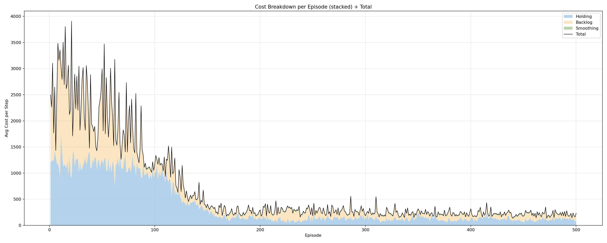
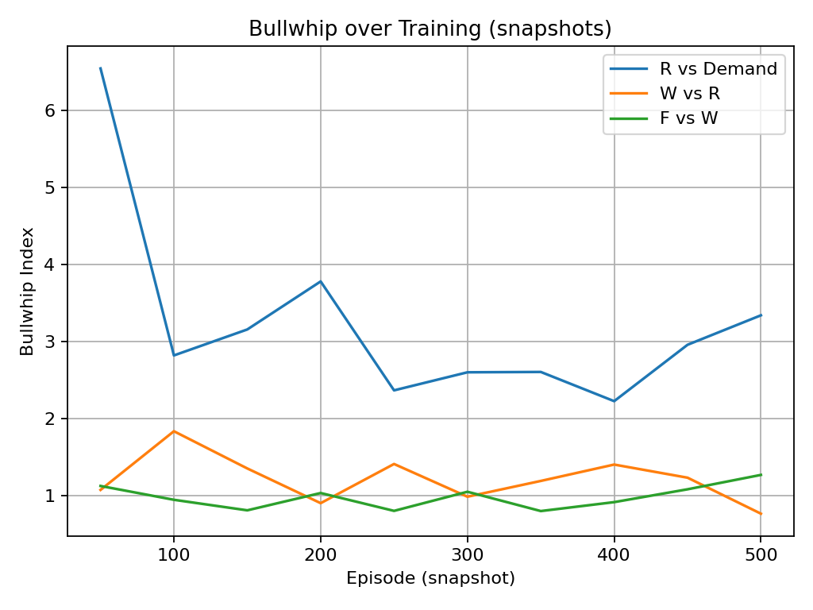
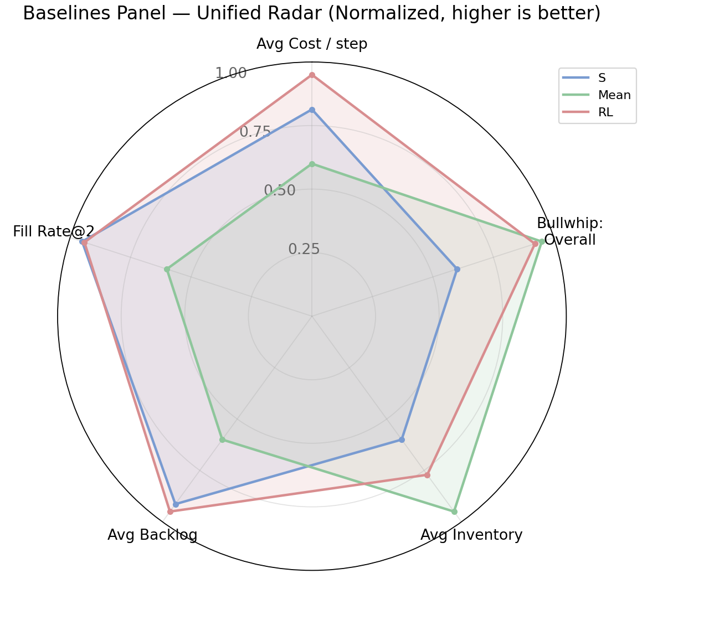
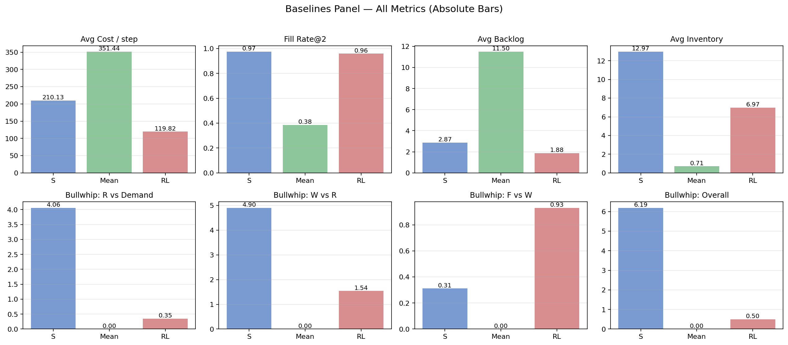
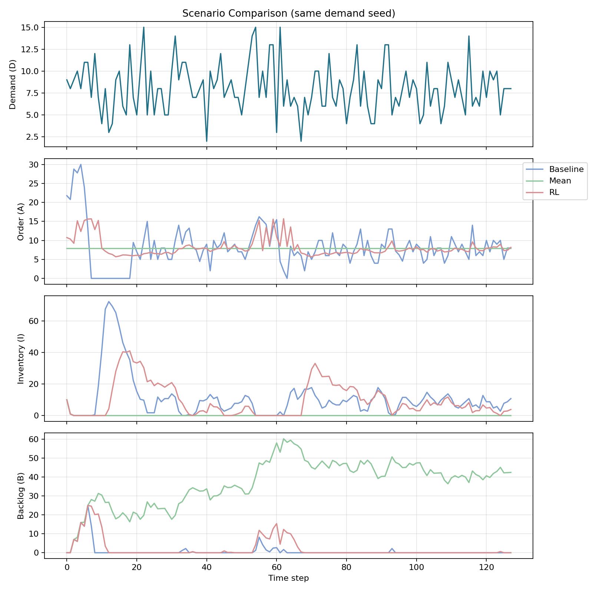
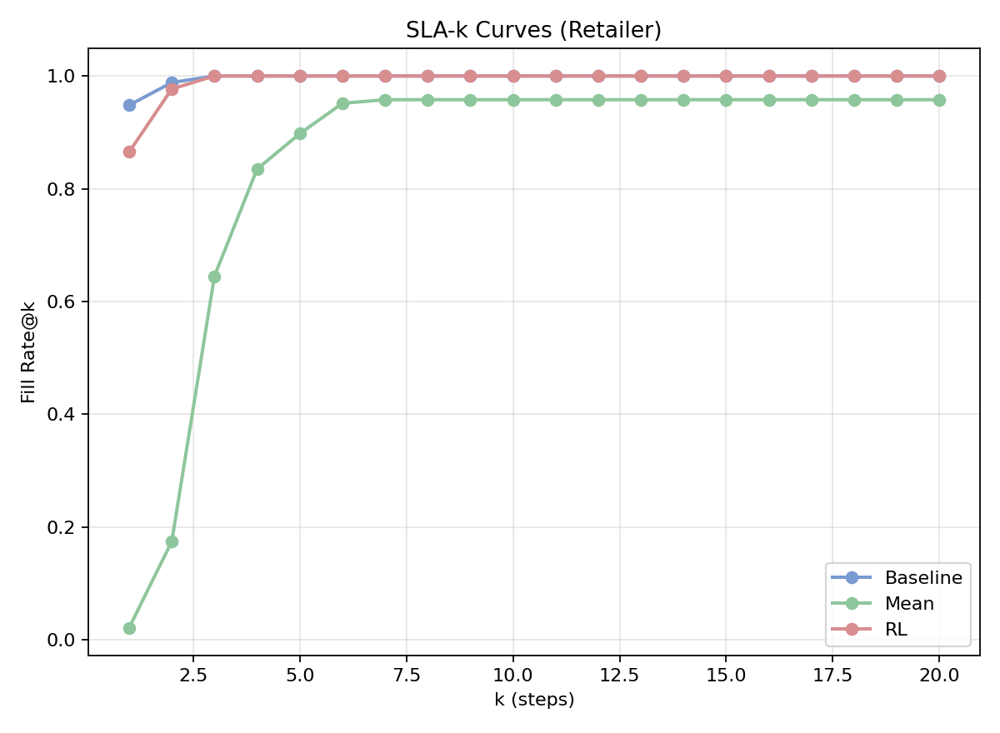
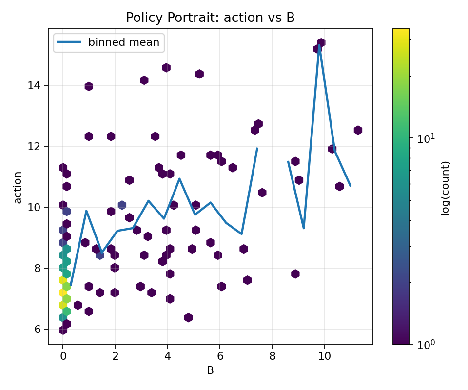

# 多智能体啤酒游戏：强化学习与牛鞭效应研究

<p align="center">
  <a href="README_zh.md">中文版本 🇨🇳</a> | <a href="README.md">English Version 🌍</a>
</p>

---

## 1. 项目概览

在供应链管理中，需求波动常常因信息延迟和不对称而被逐层放大，形成著名的牛鞭效应。经典的“啤酒游戏”实验揭示了这一现象：零售商、批发商、分销商和工厂在局部信息约束下进行决策，这往往导致库存过剩与缺货交替出现。

基于这一场景，我们构建了一个可扩展的多智能体环境，并采用 **MAPPO（Multi-Agent Proximal Policy Optimization）** 算法来研究在局部观测条件下的协同决策表现。除了复现传统的订货点策略和恒定均值订货策略外，我们还引入了 SLA-k 服务水平指标，并设计了多维度的可视化方法以系统评估不同策略的表现。

实验结果表明，强化学习智能体能够在降低平均成本的同时，有效抑制订单波动的逐层放大。在服务水平方面，MAPPO 策略能够在较短的交付时延内满足大部分需求，相较于基线方法展现出更好的稳定性与均衡性。学习曲线、雷达图、柱状图和策略画像等可视化结果为理解不同策略如何控制成本、管理风险和缓解牛鞭效应提供了直观的视角。

本项目结合了 **可复现实验、可解释的可视化与基于强化学习的策略对比**，构建了一个一体化的供应链分析框架。

---

## 2. 背景与研究动机

啤酒游戏包含四个角色：零售商 → 批发商 → 分销商 → 工厂。最终需求仅在零售端被观察到，而上游的订单在传递过程中伴随延迟与扭曲，从而产生了 **牛鞭效应**：上游的订单方差远大于下游的需求方差。

牛鞭效应的度量公式为：

\[
BW_i = \frac{\mathrm{Var}(Q_i)}{\mathrm{Var}(D)}
\]

其中 \(Q_i\) 表示第 \(i\) 层的订货序列，\(D\) 表示顾客需求序列。若 \(BW_i > 1\)，则说明波动被放大。

除了成本，企业也非常关注 **服务水平**。因此我们引入了 **SLA-k 指标**，其定义为在允许的交付延迟 \(k\) 个周期内被满足的需求比例。

---

## 3. 环境与成本建模

我们实现了 `BeerGame3Env`，支持多层链路、运输延迟和随机需求等可配置特性。每个智能体能够观测到本地状态（库存、在途、欠交），选择非负订货动作，并在延迟后接收补货。

阶段成本定义为：

\[
c_t = h I_t^+ + p B_t^+ + \lambda (a_t - a_{t-1})^2 ,
\]

其中三项分别表示持有成本、缺货成本和订货剧烈调整的平滑惩罚。成本被缩放为负回报以适配强化学习训练。

---

## 4. 评估指标

我们从多个维度评估策略：

- **平均回报**：等价于平均成本的相反数，是强化学习优化目标；  
- **即时满足率（Fill Rate）**：即时满足需求的比例；  
- **SLA-k**：在限定时延 \(k\) 内完成交付的比例；  
- **牛鞭效应指数**：订单波动在链路中的放大程度；  
- **库存与欠交水平**：风险与稳健性的辅助指标。  

---

## 5. 策略与基线

我们的 MAPPO 智能体在局部可观测条件下运行，每层一个智能体，并共享集中式价值函数以增强训练的稳定性。训练中采用 PPO-Clip 与 KL 约束保证收敛，神经网络结构为可配置的 MLP。

基线方法包括：  
(1) 基于服务水平目标推导订货上限的 (s,S) 策略；  
(2) 恒定均值订货策略，即始终订货外部需求均值。  

---

## 6. 可视化结果

以下图表展示了主要实验发现。


### 成本分解
<p align="center">
  
</p>

堆叠的成本分解图表明，训练初期的高成本主要来自欠交和库存持有惩罚。随着训练推进，这两部分成本逐渐下降，总成本收敛到显著更低的水平。

---

### 牛鞭效应
<p align="center">
  
</p>

训练过程中各层级的牛鞭效应显著减弱。MAPPO 智能体能够抑制过度的订单波动放大，使上游运作更加平稳。

---

### 基线对比
<p align="center">
  
</p>

雷达图显示 MAPPO 在多个维度上保持均衡优势。  
<p align="center">
  
</p>

柱状图进一步验证了 MAPPO 在成本、欠交与牛鞭效应上的显著优势，同时保持较高的满足率。

---

### 情景对比
<p align="center">
  
</p>

在相同需求轨迹下，MAPPO 的订货更平滑、库存更稳定，相比之下 (s,S) 策略波动剧烈，而均值订货策略则表现僵化。

---

### SLA-k 服务水平
<p align="center">
  
</p>

MAPPO 在非常小的 k 下就能达到接近 100% 的服务水平，说明其能够及时满足需求。而均值基线则需要更长的时延。

---

### 策略画像
<p align="center">
  
</p>

策略画像揭示了 MAPPO 如何根据欠交水平调整订货量。随着欠交增大，订货量也逐步增加，体现了智能体的自适应与可解释性。

---

## 7. 可复现实验

环境需要 Python 3.10+。依赖可通过 `uv`、`pip` 或 `conda` 安装。

运行训练：
```bash
python train.py --config configs/default.yaml
```

结果包括日志、图表和权重文件，保存在 `runs/beer3_mappo_*` 目录下。

---

## 8. 结果总结

MAPPO 智能体能够在供应链中降低成本、抑制牛鞭效应并提升服务水平。策略画像显示其行为具备可解释性，能够根据库存与欠交灵活调整订货。

该研究展示了多智能体强化学习在供应链协同决策中的潜力，并提供了一个可复现的研究框架。
